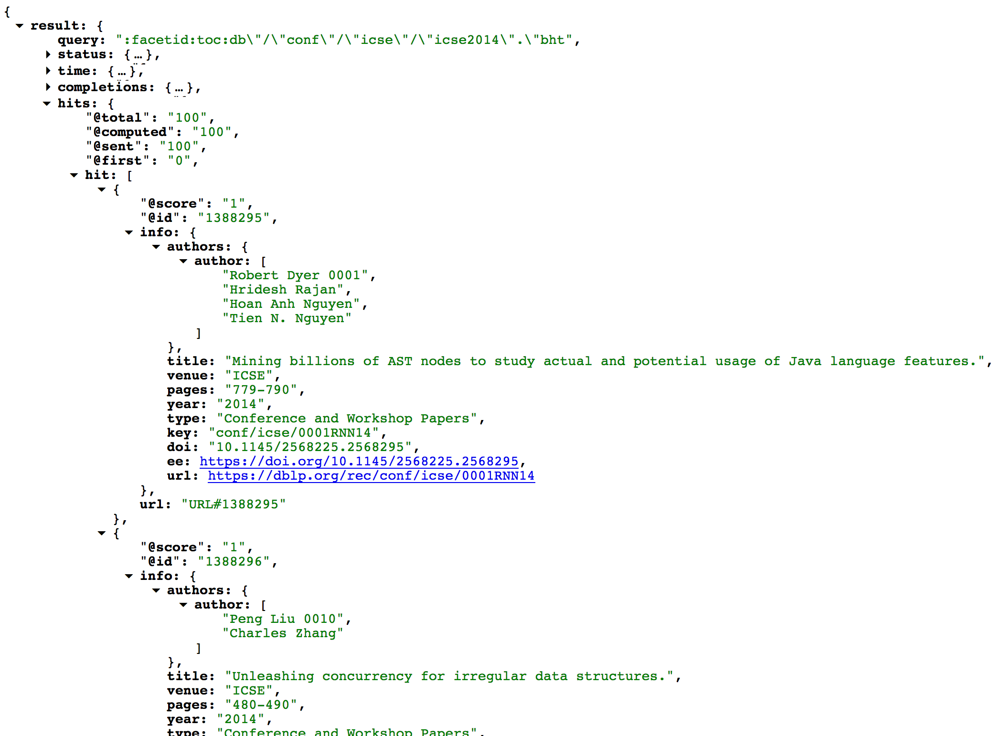

# api-retriever

Retrieve and filter data from public APIs and export it to CSV files.
Examples for supported APIs include the [GitHub API](https://developer.github.com/v3/), the [Stack Exchange API](https://api.stackexchange.com/docs), the [Google Custom Search API](https://developers.google.com/custom-search/json-api/v1/using_rest), the [unofficial Airbnb API](https://web.archive.org/web/20170519054521/http://www.airbnbapi.org/), and the [DBLP API](https://dblp.uni-trier.de/faq/13501473).

# Setup

Python 3 is required. The dependencies are specified in `requirements.txt`.
To install those dependencies execute:

    pip3 install -r requirements.txt

Optional: Setup virtual environment with [pyenv](https://github.com/pyenv/pyenv#homebrew-on-mac-os-x) 
and [virtualenv](https://github.com/pyenv/pyenv-virtualenv) before executing the above command:

    pyenv install 3.6.5
    pyenv virtualenv 3.6.5 api-retriever_3.6.5
    pyenv activate api-retriever_3.6.5
    
    pip3 install --upgrade pip

# Usage

Basic usage:

    python3 api-retriever.py -i <path_to_input_file> -o <path_to_output_dir> -c <path_to_config_file>

Call without parameters to get information about possible parameters:

    python3 api-retriever.py
    
    usage: api-retriever.py [-h] -i INPUT_FILE -o OUTPUT_DIR -c CONFIG_FILE
                        [-cd CONFIG_DIR] [-d DELIMITER] [-si START_INDEX]
                        [-cs CHUNK_SIZE]
    api-retriever.py: error: the following arguments are required: -i/--input-file, -o/--output-dir, -c/--config-file

# Configuration

The API retriever is configured using a JSON file, which must have the following structure:

    {
      "input_parameters": [],
      "ignore_input_duplicates": false,
      "uri_template": "",
      "headers": {},
      "api_keys": [],
      "delay": [],
      "pre_request_callbacks": [],
      "pre_request_callback_filter": false,
      "output_parameter_mapping": {},
      "post_request_callbacks": [],
      "post_request_callback_filter": false,
      "flatten_output": false,
      "chained_request": {}
    }

In the following, we use examples from different APIs to demonstrate the configuration parameters.
Let's start with a simple query that retrieves the licenses for a list of GitHub repositories.

## Example 1: Retrieving licenses of GitHub repositories

First of all, the value of property `input_parameters` must be an array containing the column names of the input CSV file.
In our example, the CSV file just contains one column with the names of the GitHub repositories we want to retrieve the license of.
If parameter `ignore_input_duplicates` is set to true, duplicate rows in the input file will be ignored (in this case multiple rows with the same repo name).

    {
      "input_parameters": ["repo_name"],
      "ignore_input_duplicates": true,
      // ...
    }

A corresponding CSV file could look like this:

| repo_name                          |
|------------------------------------|
| sbaltes/api-retriever              |
| sbaltes/git-log-extractor          |
| sotorrent/so-posthistory-extractor |
| ...                                |

The next parameter we are going to configure is probably the most important one.
The `uri_template` specifies how the resources is accessed.
The documentation for the GitHub repo/license API endpoint can be found [here](https://developer.github.com/v3/licenses/).
In the template, variable names are enclosed in curly braces.
In this example, the `repo_name` from the input file will be inserted into the configured position.
Most APIs use keys to authenticate users.
As some APIs require more than one key (e.g., Google Custom Search, see below), the keys are configured using an array.
In the URI template, the API keys can then be identified using their position in the array: `api_key_1` corresponds to the first element in that array, `api_key_2` to the second, and so on.

    {
      "input_parameters": ["repo_name"],
      "ignore_input_duplicates": true,
      "uri_template": "https://api.github.com/repos/{repo_name}?access_token={api_key_1}",
      "api_keys": ["8b1ef5abd3524fa98b4763384879a1ce201301d1"], // add API key here
      "headers": {},
      // ...
    }
 
It is also possible to specify custom header fields.
Retrieving the license of a repository, for example, used to be only available as an [API preview](https://developer.github.com/v3/previews/).
In that case, a custom header for the request can be configured as follows:

    {
      // ...
      "headers": {
        "Accept": "application/vnd.github.drax-preview+json"
      },
      // ...
    }

To prevent being blocked due to a large amount of queries in a short time frame, a random `delay` between the request can be configured.
In this example, the api-retriever will wait for 100 up to 2000 milliseconds before each request.
The delay is chosen randomly from that interval each time a request is made.
Pre-request callbacks are not needed for the current example and will be explained later.

    {
      "input_parameters": ["repo_name"],
      "ignore_input_duplicates": true,
      "uri_template": "https://api.github.com/repos/{repo_name}?access_token={api_key_1}",
      "api_keys": ["8b1ef5abd3524fa98b4763384879a1ce201301d1"], // add API key here
      "headers": {},
      "delay": [100, 2000],
      "pre_request_callbacks": [],
      // ...
    }

The next important parameter is the `output_parameter_mapping`.
This mapping is a JSON object with property definitions of the following structure:

    "<name_in_output>": [<path_in_json_response>]

Each property name in that object corresponds to a column in the output CSV file.
Since the JSON response is likely to contain [many fields](https://api.github.com/repos/sbaltes/api-retriever) not needed for the output, specific parts of the response can be selected.
In our example, the JSON response contains a property named `license` that is structured as follows (corresponding [query](https://api.github.com/repos/sbaltes/api-retriever)):

    // ...
    "license": {
      "key": "apache-2.0",
      "name": "Apache License 2.0",
      "spdx_id": "Apache-2.0",
      "url": "https://api.github.com/licenses/apache-2.0"
    },
    // ...

In our example, we store the property `key` of that JSON object in the output parameter `license` (which corresponds to a column `license` in the output CSV file):

    {
      "input_parameters": ["repo_name"],
      "ignore_input_duplicates": true,
      "uri_template": "https://api.github.com/repos/{repo_name}?access_token={api_key_1}",
      "api_keys": ["8b1ef5abd3524fa98b4763384879a1ce201301d1"], // add API key here
      "headers": {},
      "delay": [100, 2000],
      "pre_request_callbacks": [],
      "pre_request_callback_filter": false,
      "output_parameter_mapping": {
        "license": ["license", "key"]
      },
      // ...
    }

Finally, one can configure output filters, post request callbacks, flattened outputs, and chained requests. Those properties will be described in the examples below.
The final configuration to retrieve the licenses for a list of GitHub repositories looks like this (corresponding [configuration file](https://github.com/sbaltes/api-retriever/blob/master/config/gh_repo___license.json)):

    {
      "input_parameters": ["repo_name"],
      "ignore_input_duplicates": true,
      "uri_template": "https://api.github.com/repos/{repo_name}?access_token={api_key_1}",
      "api_keys": ["8b1ef5abd3524fa98b4763384879a1ce201301d1"], // add API key here
      "headers": {},
      "delay": [100, 2000],
      "pre_request_callbacks": [],
      "pre_request_callback_filter": false,
      "output_parameter_mapping": {
        "license": ["license", "key"]
      },
      "post_request_callbacks": [],
      "post_request_callback_filter": false,
      "flatten_output": false,
      "chained_request": {}
    }

Execution with sample data:

    python3 api-retriever.py -i -i input/gh_repos_path_branch.csv -o output -c config/gh_repo_path_branch___file.json

The resulting CSV file would look like this:

| repo_name                          | license    |
|------------------------------------|------------|
| sbaltes/api-retriever              | apache-2.0 |
| sbaltes/git-log-extractor          | gpl-3.0    |
| sotorrent/so-posthistory-extractor | apache-2.0 |
| ...                                | ...        |

## Example 2: Retrieving files from GitHub repositories

In the next example, we are going to retrieve files from GitHub repositories.
The input parameters are the `repo_name`, the `path` to the file within that repo, and the `branch` in which the file can be found.
An input file could look like this:

| repo_name                          | path                                                          | branch |
|------------------------------------|---------------------------------------------------------------|--------|
| sbaltes/api-retriever              | retriever/entity.py                                           | master |
| sbaltes/git-log-extractor          | clone_projects.sh                                             | master |
| sotorrent/so-posthistory-extractor | src/de/unitrier/st/soposthistory/blocks/PostBlockVersion.java | master |
| ...                                | ...                                                           | ...    |

We don't need an API key to retrieve files from GitHub, we can just use their raw interface:

    {
      "input_parameters": ["repo_name", "path", "branch"],
      "ignore_input_duplicates": true,
      "uri_template": "https://raw.githubusercontent.com/{repo_name}/{branch}/{path}",
      "api_keys": [],
      "headers": {},
      "delay": [40, 1000],
      "pre_request_callbacks": [],
      "pre_request_callback_filter": false,
      "output_parameter_mapping": {
        "content": ["<raw_response>"],
        "destination": ["repo_name", "path"]
      },
      "post_request_callbacks": [],
      "post_request_callback_filter": false,
      "flatten_output": false,
      "chained_request": {}
    }

Execution with sample data:

    python3 api-retriever.py -i -i input/gh_repos_path_branch.csv -o output -c config/gh_repo_path_branch___file.json

The only notable difference to the previous example is the first output parameter:

    "content": ["<raw_response>"]
    
Using the mapping `<raw_response>`, we can configure the api-retriever to save the complete raw response instead of first parsing it as JSON content and then applying the configured filter.
However, when `<raw_response>` is configured, a destination path for each retrieved file is needed.
The api-retriever searches for a `destination` parameter in the output parameter mapping and joins the configured columns from the input data.
In our example, the file `retriever/entity.py` from repo `sbaltes/api-retriever` would we written to the path `<path_to_output_dir>/sbaltes/api-retriever/retriever/entity.py`.

We can also configure a post request callback (executed after the request has been made) to set a custom path:

    "post_request_callbacks": ["set_destination_path"],

In that case, the api-retriever searches for a function named `set_destination_path` in `retriever/callbacks.py` and passes the retrieved entity to that function.
A function modifying the output path could look like this:

    def set_destination_path(entity):
        """
        Add destination path for raw content to output parameters of an entity.
        See entity configuration: gh_repo_path_branch___file
        :param entity:
        """
        if entity.output_parameters[entity.configuration.raw_parameter] is None:
            return
        repo_name = entity.input_parameters["repo_name"].split("/")
        user = repo_name[0]
        repo = repo_name[1]
        path = entity.input_parameters["path"].replace("/", " ")
        # add destination path to output
        entity.output_parameters["destination"] = os.path.join(user, repo, path)

In that case, the files would be written to `<path_to_output_dir>/<repo_name>/<converted_file_name>`, where the converted file name is the input path where slashes have been replaces with blanks.
In case of the file `retriever/entity.py`, the converted path would be `retriever entity.py`.

## Example 3: Retrieving papers using the DBLP API

In this example, we are going to retrieve papers using the [DBLP API](https://dblp.uni-trier.de/faq/13501473).
The input parameters are the `dblp_identifier` and `min_length`.
The first parameter identifies the venue, the second the minimal required length for papers to be included in the output file.

An input file could look like this:

| dblp_identifier     | min_length                                                          
|---------------------|------------
| conf/icse/icse2018  | 10                                       
| journals/tse/tse44  | 5

We don't need an API key to retrieve files from DBLP, we can just use their search API:

    {
      "input_parameters": ["dblp_identifier", "min_length"],
      "ignore_input_duplicates": false,
      "uri_template": "https://dblp.org/search/publ/api?q=toc%3Adb/{dblp_identifier}.bht%3A&format=json&h=1000",
      "api_keys": [],
      "headers": {},
      "delay": [40, 1000],
      "pre_request_callbacks": [],
      "pre_request_callback_filter": false,
      "output_parameter_mapping": {
        "papers": ["result", "hits", "hit", "*", {
          "venue": ["info", "venue"],
          "year": ["info", "year"],
          "title": ["info", "title"],
          "authors": ["info", "authors"],
          "pages": ["info", "pages"],
          "doi": ["info", "doi"],
          "electronic_edition": ["info", "ee"],
          "dblp_url": ["info", "url"]
        }]
      },
      "post_request_callbacks": ["flatten_dblp_authors", "add_paper_length", "apply_paper_length_filter", "unescape_html"],
      "post_request_callback_filter": false,
      "flatten_output": true,
      "chained_request": {}
    }

Execution with sample data:

    python3 api-retriever.py -i input/dblp_venues.csv -o output -c config/dblp___venues.json

One aspect that is new in this example is the list matching operator (`*`) in the output paramter mapping.
As mentioned above, the right-hand side of the mapping refers to a path in the JSON response.
In this example, the path `["result", "hits", "hit"]` identifies a list (JSON array) containing multiple JSON objects:

The `*` operator matches all those objects.
The following nested mapping selects only certain properties of the objects in the list:

    {
        "venue": ["info", "venue"],
        "year": ["info", "year"],
        // ...
    }

Without the `flatten_output` parameter set to `true`, the resulting list would look like this:
    
| dblp_identifier    | min_length | papers                                                                           |
|--------------------|------------|----------------------------------------------------------------------------------|
| conf/icse/icse2014 | 8          | [OrderedDict([('venue', 'ICSE'), ('year', '2014'), ('title',... |
| conf/icse/icse2016 | 8          | [OrderedDict([('venue', 'ICSE'), ('year', '2016'), ('title'... |
| conf/icse/icse2017 | 8          | [OrderedDict([('venue', 'ICSE'), ('year', '2017'), ('title'... |

In the flattened result, each object from the list is stored in a separate row:

| dblp_identifier    | min_length | venue | year | title                                                                                       | authors                                                     | pages   | doi                     | electronic_edition                      | dblp_url                                 | length |
|--------------------|------------|-------|------|---------------------------------------------------------------------------------------------|-------------------------------------------------------------|---------|-------------------------|-----------------------------------------|------------------------------------------|--------|
| conf/icse/icse2014 | 8          | ICSE  | 2014 | Mining billions of AST nodes to study actual and potential usage of Java language features. | Robert Dyer; Hridesh Rajan; Hoan Anh Nguyen; Tien N. Nguyen | 779-790 | 10.1145/2568225.2568295 | https://doi.org/10.1145/2568225.2568295 | https://dblp.org/rec/conf/icse/0001RNN14 | 12     |
| conf/icse/icse2014 | 8          | ICSE  | 2014 | Unleashing concurrency for irregular data structures.                                       | Peng Liu; Charles Zhang                                     | 480-490 | 10.1145/2568225.2568277 | https://doi.org/10.1145/2568225.2568277 | https://dblp.org/rec/conf/icse/0010Z14   | 11     |
| conf/icse/icse2014 | 8          | ICSE  | 2014 | Integrating adaptive user interface capabilities in enterprise applications.                | Pierre A. Akiki; Arosha K. Bandara; Yijun Yu                | 712-723 | 10.1145/2568225.2568230 | https://doi.org/10.1145/2568225.2568230 | https://dblp.org/rec/conf/icse/AkikiBY14 | 12     |
| ...                | ...        | ...   | ...  | ...                                                                                         | ...                                                         | ...     | ...                     | ...                                     | ...                                      | ...    |

The callback `flatten_dblp_authors` removes the disambiguation numbering that DBLP uses and joins all authors into a semicolon-separated list.

The callback `add_paper_length` calculates the paper length based on the provided page range.

The callback `apply_paper_length_filter` filters papers according to the configured minimal paper length.

The callback `unescape_html` unescapes HTML characters in paper titles.

## Example 4: Airbnb

A configuration file that can be used to retrieve information about Airbnb hosts can be found [here](config/airbnb_host___data.json):

    python3 api-retriever.py -i -i input/airbnb_hosts.csv -o output -c config/airbnb_host___data.json
